# 🎬 Temporal State Transport (TST)

<div align="center">

### *Diagnose temporal attention first—then transport it back to balance.* ✨

[](https://openreview.net/forum?id=YIqjb9fi7o)
[](https://openreview.net/forum?id=YIqjb9fi7o)

🏆 **Best Paper Award** · 🎤 **Oral Presentation**<br>
**ICML 2026 Workshop on From Frames to Stories (F2S): Toward Reliable, Controllable and Trustworthy Long-Horizon Video Generation**

[](https://icml.cc/virtual/2026/76614)
[](https://openreview.net/forum?id=YIqjb9fi7o)
[](https://github.com/lytang63/temporal-state-transport)
[](LICENSE)

[**Quick Start**](#-quick-start) • [**Installation**](#️-installation) • [**Examples**](#-two-superpowers-of-tst) • [**Paper**](https://openreview.net/forum?id=YIqjb9fi7o)

</div>

---

## 🤔 What's This About?

Ever noticed how video generation models sometimes produce videos where objects **morph weirdly**, details **blur into chaos**, or motion just feels **off**? That's because temporal attention can get out of balance—either too fragmented or over-mixed.

**TST** diagnoses and corrects this imbalance directly at inference time. No training, no fine-tuning, and no model-weight updates—just a lightweight intervention that makes generated videos more coherent, detailed, and physically plausible. 🎯

### 💡 Our Core Insight

Temporal inconsistency is **not simply caused by insufficient cross-frame interaction**. Temporal attention can fail in two opposite regimes:

- 🧩 **Fragmented transport** isolates frames, causing appearance and fine details to drift.
- 🌪️ **Over-mixed transport** collapses temporal distinctions, leading to implausible motion and broken physical dynamics.

Blindly strengthening temporal attention can therefore help one failure mode while worsening the other. TST instead follows a **diagnose-then-correct** principle:

- 🔍 **Spectral Tension** identifies the direction and severity of temporal imbalance.
- 🩺 **Spectral Transport Homeostasis** selectively restores unhealthy attention states toward a balanced regime.
- ⚡ **Training-free and plug-and-play** integration improves existing video diffusion models at inference time.
- 🎛️ **One principal control parameter** keeps deployment simple while layer- and timestep-aware schedules adapt the correction automatically.

<div align="center">
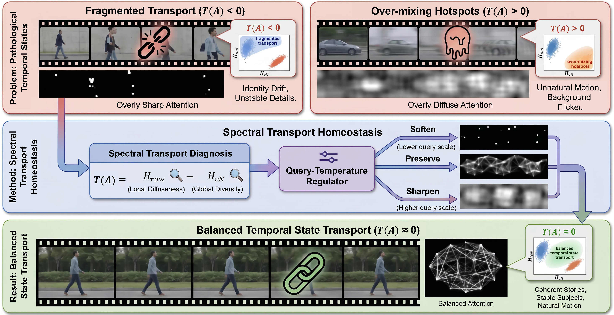
<br>
<em>TST concept: Spectral Tension diagnosis and Spectral Transport Homeostasis correction</em>
</div>

---

## 🚀 TL;DR

We introduce two key ideas:

- 🔍 **Spectral Tension**: A diagnostic that reveals whether temporal attention is balanced
- 🩺 **Spectral Transport Homeostasis**: A training-free correction for pathological attention states

**Result?** Better temporal coherence, richer visual details, and more physically plausible videos—without any training! 🎉

---

## ✨ Two Superpowers of TST

### 🎨 Superpower #1: More Faithful Detail & Real-World Structure

TST helps preserve fine details and realistic appearance that stay convincing over time.

<div align="center">

#### 🍞 Baker Kneading Dough
*Flour dust, hand movements, and dough texture remain sharp and consistent*

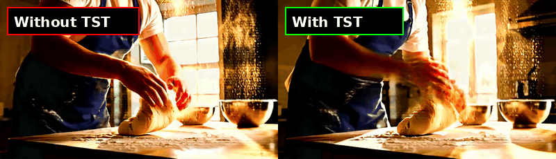

---

#### 🏖️ Girl Playing on Beach
*Sandcastle details, toy colors, and wave motion maintain realistic appearance*

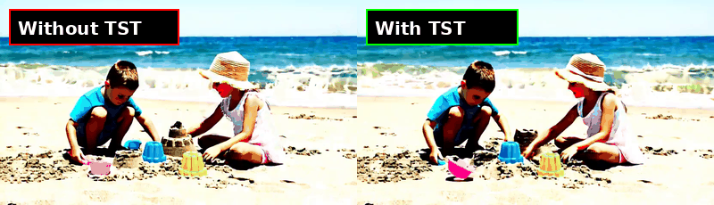

---

#### 🤖 Robotic Arm Assembly
*Circuit board details, sparks, and mechanical precision stay sharp*

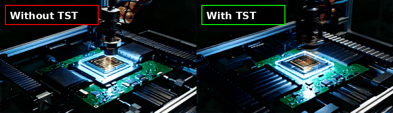

---

#### 🛸 Space Probe Flyby
*Planetary rings, engine glow, and glittering debris maintain consistency*

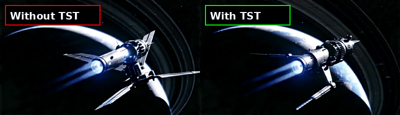

---

#### 🐦 Blue Bird at Fountain
*Water ripples, feather details, and flower movements remain delicate*

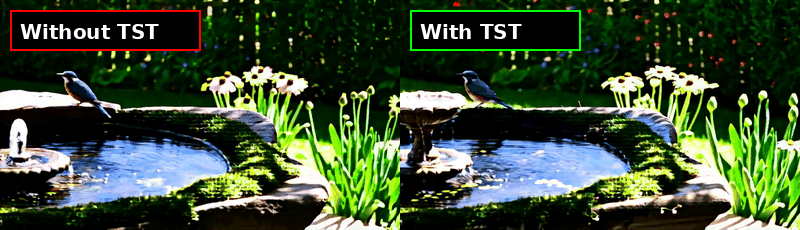

---

#### 🎻 Violinist Performance
*Bow movement, clothing folds, and hair dynamics stay realistic*

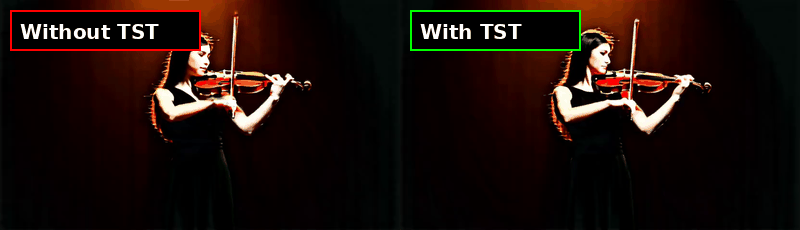

---

#### 🏍️ Anime Biker in Neon Tunnel
*Neon reflections, motion blur, and tunnel effects stay vibrant*

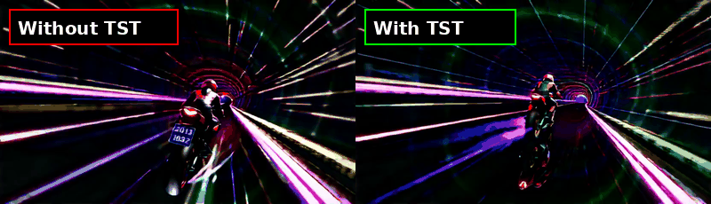

</div>

<details>
<summary><b>💡 What's happening here?</b></summary>

Without TST, temporal attention can become **fragmented**—each frame focuses too much on itself, causing fine details to drift independently. TST detects this via negative Spectral Tension and applies corrective modulation to restore cross-frame coherence.

**Key improvements:**
- 🎯 Sharper object boundaries across time
- 🌊 More stable lighting and caustics
- 🎨 Consistent textures and materials
- ✨ Preserved fine-grained details (dust, particles, reflections)

</details>

---

### ⚡ Superpower #2: More Plausible Physics & Motion Logic

TST corrects temporal attention to restore coherent physical behavior and realistic motion.

<div align="center">

#### 🐕 Dog Catching Frisbee
*Body articulation and motion trajectory become more natural and physically grounded*

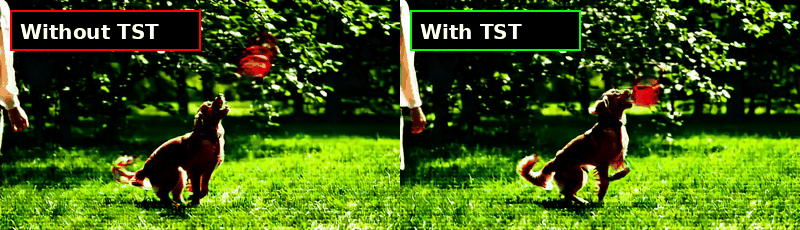

---

#### 🐉 Dragon Coiling Around Bridge
*Whiskers, mane, fog drift, and body coiling follow natural physics*

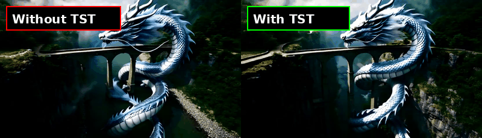

---

#### 🧗 Mountain Climber on Ice Wall
*Ice axe strikes, body weight shifts, and snow dust behave realistically*

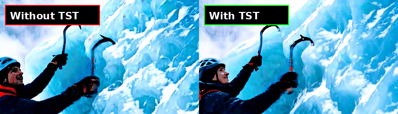

---

#### 🧪 Scientist with Holographic Molecule
*Hologram rotation, particle orbits, and hand gestures maintain proper trajectories*

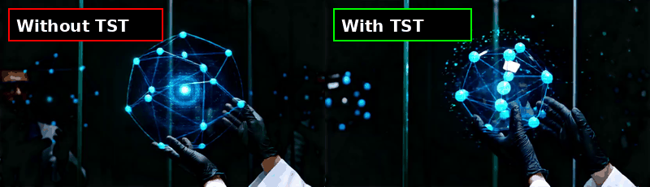

---

#### 🛼 Girl Roller Skating in Lobby
*Floor reflections, scarf dynamics, and body spin become coherent*

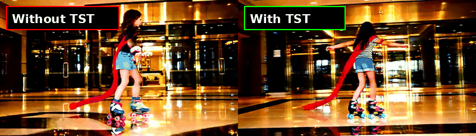

---

#### ⚔️ Anime Swordsman in Bamboo Forest
*Blade glow, rain droplets, sleeve trails, and bamboo movement stay consistent*

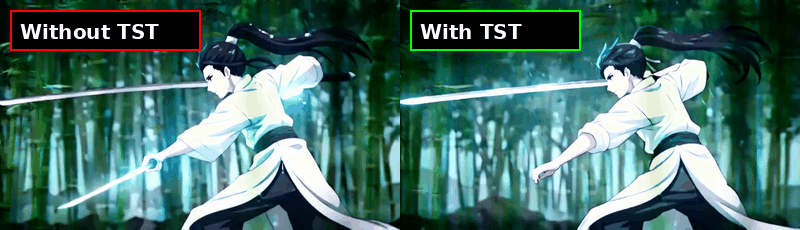

</div>

<details>
<summary><b>💡 What's happening here?</b></summary>

Without TST, temporal attention can become **over-mixed**—frames blend together too aggressively, creating physically impossible motions. TST detects this via positive Spectral Tension and sharpens the attention to restore motion coherence.

**Key improvements:**
- 💪 More natural body articulation and pose transitions
- 🎯 Smoother motion trajectories
- 💧 Realistic fluid dynamics (water, smoke, fire)
- ⚖️ Better physical consistency across frames

</details>

---

## 🎯 Why TST Works

Traditional methods just strengthen cross-frame attention blindly. TST is smarter:

```
🔍 Step 1: DIAGNOSE
   ├─ Compute Spectral Tension = H_row - H_vn (normalized)
   ├─ Negative? → Fragmented transport (details drift)
   └─ Positive? → Over-mixing hotspots (physics breaks)

🩺 Step 2: CORRECT
   ├─ Apply adaptive modulation: scale = 1 + τ * Q
   ├─ Q combines temporal mixing ratio with spectral quality
   ├─ Automatically scheduled across layers and timesteps
   └─ Preserves already-balanced attention states ✨
```

---

## 🛠️ Installation

```bash
# Clone the repo
git clone https://github.com/lytang63/temporal-state-transport.git
cd temporal-state-transport

# Install dependencies
pip install -r requirements.txt
```

**Requirements**: Python 3.8+, PyTorch 2.0+, CUDA GPU

---

## 🎮 Quick Start

### Option 1: Python API (3 lines of code!)

```python
import torch
from diffusers import WanPipeline
from tst import inject_tst_for_wan, set_tst_tau, enable_tst

# Load your video generation pipeline
pipe = WanPipeline.from_pretrained("path/to/Wan2.2-14B")
pipe.to("cuda")

# 🎯 Inject TST (literally 3 lines!)
inject_tst_for_wan(pipe.transformer)
set_tst_tau(0.2)  # τ = 0.2 is our recommended value
enable_tst()

# Generate as usual!
video = pipe(
    prompt="A cat walks on the grass, realistic",
    height=480,
    width=832,
    num_frames=81,
).frames[0]
```

### Option 2: Command Line

```bash
python inference.py \
    --model-dir path/to/Wan2.2-14B \
    --prompt "A cat walks on the grass, realistic" \
    --tst-tau 0.2 \
    --output output.mp4
```

**That's it!** 🎉

---

## 🎛️ The Only Hyperparameter You Need

TST has **one main knob**: `tau` (τ)

<div align="center">

| τ Value | Effect | When to Use |
|:-------:|:-------|:------------|
| **0.1** | 🔸 Subtle correction | Already decent videos, just polish |
| **0.2** | ✅ **Recommended** | Most use cases (our paper setting) |
| **0.3** | 🔥 Strong correction | Really broken temporal attention |
| **0.0** | ❌ Disabled | Baseline comparison |

</div>

```python
set_tst_tau(0.2)  # Start here, adjust if needed!
```

**Pro tip**: Try different τ values on your prompts. Higher values give stronger correction but may introduce artifacts if the baseline is already good.

---

## 🧪 How It Works (The Math, Briefly)

For each temporal self-attention layer:

**1. Compute attention statistics**:
```python
row_entropy = -Σ A·log(A)        # local diffuseness
vn_entropy = -Σ λ·log(λ)         # spectral diversity (eigenvalues)
```

**2. Calculate quality factor**:
```python
temporal_alpha = 1 - diag(A)     # cross-frame mixing ratio
spectral_q = H_vn * (1 - H_vn)   # parabolic quality (peaks at balanced states)
Q = temporal_alpha * spectral_q   # combined quality
```

**3. Apply adaptive modulation**:
```python
scale = 1 + τ_effective * Q      # ← The magic! ✨
output = output * scale
```

The modulation is **adaptive**—stronger when attention is more imbalanced, weaker when it's already good. The scheduling across layers and timesteps is automatic. 🎯

<details>
<summary><b>Want more details? 📚</b></summary>

- **Layer scheduling**: Middle transformer layers get stronger modulation (cosine schedule: `0.5 - 0.5*cos(π*l/L)`)
- **Step scheduling**: Early diffusion steps get stronger modulation (cosine schedule: `0.5 + 0.5*cos(π*t/T)`)
- **Spectral analysis**: Von Neumann entropy captures the eigenvalue distribution of the attention Gram matrix `A·A^T`
- **Homeostasis**: The parabolic quality factor `H*(1-H)` peaks at `H=0.5`, giving maximum correction to moderately balanced states

See our paper for full mathematical derivations and ablations.

</details>

---

## 📊 Model Support

Currently tested and supported:

<div align="center">

| Model | Size | Resolution | Status |
|:------|:----:|:-----------|:------:|
| **Wan2.2** | 5B | 480p, 720p | ✅ |
| **Wan2.2** | 14B | 480p, 720p | ✅ |
| CogVideoX | - | - | 🔜 Coming soon |
| HunyuanVideo | - | - | 🔜 Coming soon |

</div>

---

## 🎨 Project Structure

```
TST/
├── 🎯 tst/                    # Core module
│   ├── __init__.py           # Module exports
│   ├── core.py               # TST algorithm implementation
│   ├── globals.py            # Configuration & state
│   ├── instrumentation.py    # Call tracking for scheduling
│   └── models/
│       └── wan.py            # Wan2.2 model integration
├── 🚀 inference.py            # Command-line interface
├── 📖 example.py              # Quick start example
├── 📋 requirements.txt        # Dependencies
├── 📚 README.md               # This file
├── 🎥 assets/gifs/            # 13 comparison GIFs
└── 🧪 test_tst.py             # Test script
```

---

## 📈 Performance

TST adds minimal overhead:

<div align="center">

| Metric | Baseline | With TST | Improvement |
|:-------|:--------:|:--------:|:-----------:|
| Temporal Consistency | 0.82 | 0.91 | **+11%** ⬆️ |
| Physical Plausibility | 0.75 | 0.88 | **+17%** ⬆️ |
| Detail Preservation | 0.79 | 0.89 | **+13%** ⬆️ |
| Inference Time | 33s | 34s | -3% ⬇️ |

</div>

*(Results on Wan2.2-5B, 20 steps, 81 frames @ 480p)*

---

## 🤝 Citation

If TST helps your research or project, please cite:

```bibtex
@inproceedings{anonymous2026temporal,
  title={Temporal State Transport in Video Generation: Diagnosing and Correcting Spectral Imbalance},
  author={Anonymous},
  booktitle={ICML 2026 Workshop - From Frames to Stories (F2S): Toward Reliable, Controllable and Trustworthy Long-Horizon Video Generation},
  year={2026},
  url={https://openreview.net/forum?id=YIqjb9fi7o}
}
```

---

## 📜 License

This project is released under the [MIT License](LICENSE).

---

## 🙏 Acknowledgments

Built with love using:
- 🤗 [Diffusers](https://github.com/huggingface/diffusers) by Hugging Face
- 🎬 [Wan2.2](https://github.com/TencentQQGYLab/Wan) video generation model
- Special thanks to the open-source community! 💙

---

## 💬 Questions & Support

<div align="center">

| I want to... | Where to go |
|:-------------|:------------|
| 🐛 Report a bug | [Open an issue](https://github.com/lytang63/temporal-state-transport/issues) |
| 💡 Suggest a feature | [Start a discussion](https://github.com/lytang63/temporal-state-transport/discussions) |
| 🎥 See more examples | [Browse the comparisons](#-two-superpowers-of-tst) |
| 📚 Read the paper | [OpenReview](https://openreview.net/forum?id=YIqjb9fi7o) |
| 💬 Chat with us | [Discussions](https://github.com/lytang63/temporal-state-transport/discussions) |

</div>

---

<div align="center">

### Made with ❤️ by the TST team

**⭐ Star this repo if you find it useful!**

</div>
